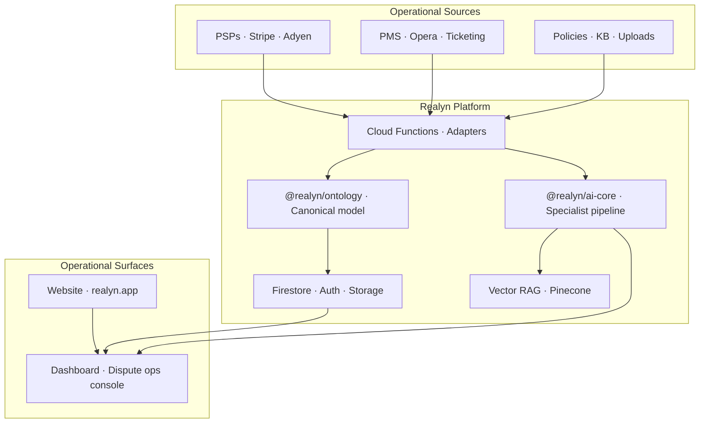

<p align="center">
  <picture>
    <source media="(prefers-color-scheme: dark)" srcset="assets/brand/realyn_wordmark_white.png" />
    
  </picture>
</p>

<p align="center">
  <strong>The dispute operations platform for revenue-critical merchants.</strong><br />
  Unify payment, booking, and operational data into a single operational layer — then defend chargebacks at scale.
</p>

<p align="center">
  <a href="https://realyn.app">Website</a> ·
  <a href="https://dashboard.realyn.app">Dashboard</a> ·
  <a href="#architecture">Architecture</a> ·
  <a href="#development">Development</a>
</p>

<p align="center">
  
  
  
  
</p>

---

## Purpose

Merchants lose billions annually to chargebacks — not because the evidence doesn't exist, but because it is **fragmented across systems** that were never designed to work together. Payment processors hold the dispute. PMS and ticketing platforms hold the stay or order record. Operations teams hold the proof. Finance holds the policy.

**Realyn is the operational layer that connects them.**

Built like mission-critical infrastructure — not another SaaS dashboard — Realyn ingests disputes from any PSP, resolves them against your operational data model, orchestrates AI-augmented evidence assembly, and submits processor-ready responses with full auditability. Hospitality and ticketing are first-class verticals; the platform is industry-agnostic by design.

> *Chargeback defense is an operations problem disguised as a payments problem. Realyn treats it that way.*

---

## The Platform

Realyn is structured around four operational capabilities — the same primitives enterprises expect from data platforms, applied to dispute defense:

| Capability | What it does |
|---|---|
| **Integrate** | Ingest disputes from Stripe, Adyen, and extensible PSP adapters. Pull booking, folio, and transaction context from PMS and ops systems (Opera Cloud OHIP, CSV/XML imports, ticketing stacks). |
| **Ontologize** | Map disparate records into a canonical dispute model (`@realyn/ontology`) — disputes, evidence, organizations, and audit events share one schema across dashboard, backend, and AI pipeline. |
| **Operate** | Run end-to-end workflows: intake → classification → evidence planning → assembly → review → submission. Configurable approval gates. Immutable activity log. |
| **Defend** | AI specialist pipeline plans evidence, scores relevance, drafts processor-mapped arguments, and submits via PSP APIs — with human-in-the-loop control at every decision point. |

---

## Workflow

Four stages. One operational thread from detection to submission.

```
  INGEST          CLASSIFY         ASSEMBLE          SUBMIT
     │                │                │                │
  PSP webhooks    Dispute code     Evidence plan    Stripe / Adyen
  + sync jobs     + vertical KB    + RAG retrieval  evidence API
     │                │                │                │
     └────────────────┴────────────────┴────────────────┘
                              │
                    Canonical dispute record
                    (ontology + audit trail)
```

1. **Ingest** — Disputes arrive via webhooks and scheduled sync. Payment metadata is normalized across processors.
2. **Classify** — Dispute reason codes are mapped to vertical-specific evidence strategies and winnability heuristics.
3. **Assemble** — AI plans required evidence, auto-collects from connected systems, and retrieves relevant policy/KB context via RAG.
4. **Submit** — Responses are drafted in processor-native format, reviewed under governance rules, and submitted with receipt confirmation.

---

## Architecture



### Monorepo

| Package | Role |
|---|---|
| `packages/dashboard` | React 19 operations console — dispute queue, evidence workflow, analytics, integrations |
| `packages/ai-core` | Portable AI pipeline — evidence planner, argument generator, RAG, LLM providers, vertical KB |
| `packages/ontology` | Canonical domain schemas — single source of truth for disputes, evidence, orgs, audit |
| `packages/shared` | Shared types, Firebase config, UI primitives |
| `packages/website` | Marketing site and product narrative |
| `functions/` | Firebase Cloud Functions — webhooks, triggers, PSP/PMS adapters, Firestore persistence |

---

## Vertical Configurations

Realyn ships with industry-specific evidence strategies — not generic templates.

| Vertical | Configuration |
|---|---|
| **Hospitality** | PMS-connected defense. Guest disputes matched to folio data, check-in logs, signed agreements, and service records. |
| **Ticketing** | Event-level evidence. Order records, delivery/scan proof, refund policy, and communication history. |
| **General / CNP** | Authentication evidence — 3DS records, AVS/CVV verification, IP geolocation — packaged for issuer review. |

Vertical rules, KB content, and specialist prompts live in `packages/ai-core/src/verticals/`.

---

## AI Pipeline

The AI layer is a **specialist orchestration pipeline**, not a single prompt:

- **Evidence Planner** — Analyzes dispute type, recommends fight/accept, generates prioritized evidence requirements
- **Claim Analyst & Strategy Advisor** — Winnability assessment and response strategy
- **Evidence Relevance Scorer & Plan Checker** — Quality gates before submission
- **Argument Generator** — Processor-mapped response drafting with RAG-grounded policy context
- **Provider-agnostic LLM** — OpenAI or Anthropic, switchable per deployment

RAG retrieval uses dense + sparse embeddings with reranking. PII is sanitized before model calls.

---

## Governance

Built for finance and compliance teams who need to trust the system, not just use it.

- **Auditability** — Immutable action log for every dispute decision
- **Governance** — Configurable approval policies before processor submission
- **Traceability** — Every response field mapped to source evidence records
- **Reliability** — Automatic retry with processor receipt confirmation
- **Privacy** — GDPR-ready data processing; PII sanitization in AI pipeline

---

## Integrations

**Payment processors:** Stripe, Adyen (adapter pattern — extensible to Braintree, Worldpay, Checkout.com, and others)

**Operational systems:** Oracle Opera Cloud OHIP, Opera CSV/XML/delimited imports, ticketing platform adapters

**Infrastructure:** Firebase (Auth, Firestore, Storage, Cloud Functions), Pinecone (vector retrieval)

---

## Development

### Prerequisites

- Node.js 20+
- Java 17+ (Firestore emulator)
- Firebase CLI

### Quick start

```bash
# Install
npm install

# First-time emulator setup (creates packages/dashboard/.env.local)
npm run setup:dashboard:emulator

# Start emulators + dashboard
npm run dev:dashboard:emulators

# Seed demo data (in another terminal, emulators must be running)
npm run seed:dice:emulator    # or seed:nimax:emulator / seed:skiddle:emulator / etc.
```

Dashboard: **http://localhost:3001** · Emulator UI: **http://127.0.0.1:4000**

Demo credentials are defined in `functions/src/lib/*DemoConstants.ts`.

### Common commands

```bash
npm run dev:dashboard              # Dashboard only (port 3001)
npm run dev:emulators              # Firebase emulators only
npm run build:dashboard            # Production build
npm run deploy:functions           # Deploy Cloud Functions

# Type-check (build ai-core first — functions resolves from dist/)
cd packages/ai-core && npm run build
cd ../../functions && npx tsc --noEmit
cd ../packages/dashboard && npx tsc --noEmit

# Tests
cd packages/ai-core && npm test
cd ../../functions && npm test
```

### Firebase emulators

| Service | Port | UI |
|---|---|---|
| Auth | 9099 | http://127.0.0.1:4000/auth |
| Firestore | 8080 | http://127.0.0.1:4000/firestore |
| Storage | 9199 | http://127.0.0.1:4000/storage |
| Functions | 5001 | http://127.0.0.1:4000/functions |

The dashboard connects to emulators when `VITE_USE_FIREBASE_EMULATORS=true` in `packages/dashboard/.env`. With emulators on, `VITE_FIREBASE_FUNCTIONS_URL` must point at the local Functions emulator or authenticated requests will return 401.

Emulator data persists in `./emulator-data/` between restarts.

### Demo login troubleshooting

Firebase returns `auth/user-not-found` when the dashboard project does not match where users were seeded:

- **Emulators on** → run `npm run seed:*:emulator` while emulators are running
- **Emulators off** → run `npm run seed:dice` (or other cloud seeds) with ADC for the target Firebase project

Deployed production Functions disable HTTP demo seed endpoints (403). Use CLI seeds for cloud environments.

---

## Tech Stack

| Layer | Technologies |
|---|---|
| Frontend | React 19, TypeScript, Vite, Tailwind CSS |
| Backend | Firebase Cloud Functions (Node 20), Firestore, Auth, Storage |
| AI | Anthropic Claude / OpenAI, Pinecone, specialist pipeline in `@realyn/ai-core` |
| PSP | Stripe, Adyen |
| Ops data | Opera Cloud OHIP, PMS import parsers, ticketing adapters |

---

## Links

- **Product:** [realyn.app](https://realyn.app)
- **Dashboard:** [dashboard.realyn.app](https://dashboard.realyn.app)
- **Contact:** [realyn.app/contact](https://realyn.app/contact)

---

<p align="center">
  <sub>Realyn Ltd · Dispute operations infrastructure for the modern merchant</sub>
</p>
