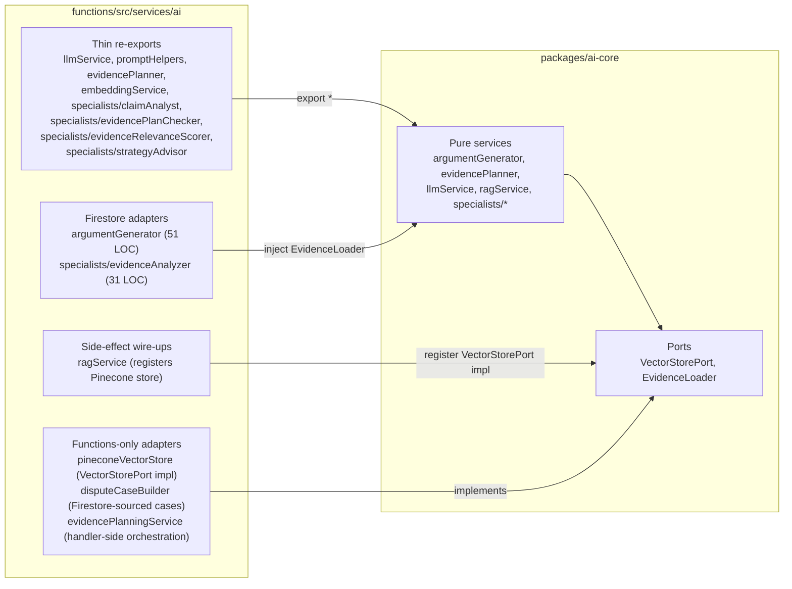

# AI Services Architecture

How `packages/ai-core` and `functions/src/services/ai` fit together.

## TL;DR

These are not duplicates. They are two halves of a **ports-and-adapters** (hexagonal) split:

- `packages/ai-core/` is the **pure domain** (no Firebase, no Pinecone, no I/O). It contains the real, heavy implementations (150–1200 LOC per service) and defines **ports** like `VectorStorePort` and `EvidenceLoader` for things it can't do on its own.
- `functions/src/services/ai/` is the **consumption-edge layer** inside Cloud Functions. Most of its files are 4-line re-exports; a handful are thin adapters that plug Firebase/Firestore/Pinecone into the ports defined by `ai-core`.

If you're inside `functions/*` code and want to call an AI service, `import … from "../services/ai/llmService"` (or whichever file). That path is stable even when the pure logic moves inside `@realyn/ai-core`.

## Diagram

## The file-by-file breakdown

### Eight thin re-exports

Exist purely so functions-internal code can `import from "../services/ai/X"` with a consistent local path, even when the real logic lives in a sibling package.

| `functions/src/services/ai/...` | LOC | Points at |
|---|---|---|
| `llmService.ts` | 4 | `@realyn/ai-core/services/llmService` |
| `promptHelpers.ts` | 4 | `@realyn/ai-core/services/promptHelpers` |
| `evidencePlanner.ts` | 4 | `@realyn/ai-core/services/evidencePlanner` |
| `embeddingService.ts` | 9 | `@realyn/ai-core/services/embeddingService` |
| `specialists/claimAnalyst.ts` | 4 | `@realyn/ai-core/services/specialists/claimAnalyst` |
| `specialists/evidencePlanChecker.ts` | 4 | `@realyn/ai-core/services/specialists/evidencePlanChecker` |
| `specialists/evidenceRelevanceScorer.ts` | 4 | `@realyn/ai-core/services/specialists/evidenceRelevanceScorer` |
| `specialists/strategyAdvisor.ts` | 4 | `@realyn/ai-core/services/specialists/strategyAdvisor` |

### Two Firestore adapter wrappers

These files are where the "domain vs. edge" split earns its keep. The pure implementations in `@realyn/ai-core` don't know what Firestore is; these tiny wrappers inject a Firestore-backed port implementation.

- **`functions/src/services/ai/argumentGenerator.ts`** (51 LOC). Re-exports `generateDisputeArgument` from `@realyn/ai-core`, but injects an `EvidenceLoader` backed by `evidenceService.getEnrichedEvidence` (which reads Firestore + Storage). The pure function accepts any loader; the functions-side wrapper supplies the Firestore one.
- **`functions/src/services/ai/specialists/evidenceAnalyzer.ts`** (31 LOC). Same pattern for the evidence-analysis specialist — imports `firebase-admin` and provides a Firestore-backed loader.

### One side-effecting wire-up

- **`functions/src/services/ai/ragService.ts`** (21 LOC). Re-exports the `ragService` from `@realyn/ai-core`, **but importing it has the side effect** of registering `pineconeVectorStore` as the default `VectorStorePort` implementation. This keeps the pure RAG code swap-testable (the test suite can register a fake store) while Cloud Functions transparently get Pinecone in prod.

### Three functions-only adapters

These live in `functions/` because they depend on things that can't be in `@realyn/ai-core` (Firebase Admin SDK, Pinecone client, handler orchestration).

- **`pineconeVectorStore.ts`** — concrete `VectorStorePort` implementation backed by `@pinecone-database/pinecone`. Lazy client init so Cloud Functions cold-start doesn't fail when `PINECONE_API_KEY` isn't yet read.
- **`disputeCaseBuilder.ts`** — hydrates a `DisputeCase` from Firestore documents. Can't live in ai-core; it imports `firebase-admin`.
- **`evidencePlanningService.ts`** — handler-side orchestration layer between the HTTP endpoint and the pure `evidencePlanner` in ai-core.

## Why this matters

- **Swap-testable.** Tests in `@realyn/ai-core` don't need Firebase or Pinecone to run. They inject fake `EvidenceLoader` and `VectorStorePort` implementations.
- **Deploy-lean.** Cloud Functions only imports what it needs via the `exports` map in `@realyn/ai-core/package.json` (~25 subpaths, tree-shakeable).
- **Future vector stores.** If we add pgvector or Firestore vector indexes, they become additional implementations of `VectorStorePort` alongside `pineconeVectorStore.ts` — no changes to the pure RAG code.
- **Future non-Firebase consumers.** If we ever run AI logic outside Cloud Functions (e.g. a worker, CLI, or different cloud), we don't rewrite anything — we just provide different adapters for the ports.

## Please don't do

- Don't re-implement logic from `@realyn/ai-core` inside `functions/`. Add a port if needed and inject it at the edge.
- Don't import `firebase-admin` or `@pinecone-database/pinecone` inside `packages/ai-core`. If you find yourself wanting to, you're looking at the wrong layer.
- Don't flatten the re-export files thinking they're dead code. Removing them creates churn at every functions-internal call site.
